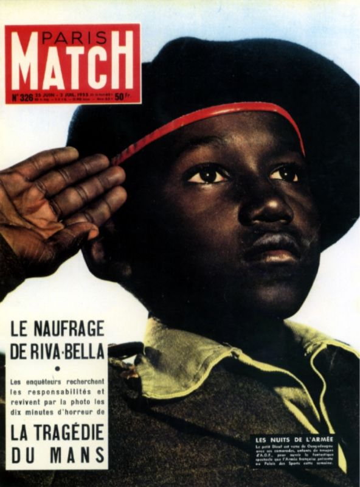

# Visual Rhetoric Atlas

## Description
A research space for studying how images address viewers. Its Visual Rhetoric Reader agent grounds provisional interpretations in visible evidence and context, drawing on Peircean semiotics while leaving claims about rhetorical effects open to human review.

## Demo

The atlas builds a corpus of images and structured interpretations for later data mining. A single entry connects an image, an existing human analysis where available, and an AI-generated reading.

### Example: Barthes’s reading of a *Paris Match* cover



**Human analysis — brief paraphrase:**

Barthes reads the image of a Black soldier saluting as an expression of French imperial identity. A particular person’s gesture becomes a vehicle for presenting an ideological claim about the empire as something natural and self-evident.

**AI structured reading — illustrative output:**

The following shows how an AI reading could be recorded when supplied with the image and Barthes’s analysis. It is an example of the intended format, not an actual model result.

```json
{
  "observations": [
    {
      "id": "o1",
      "description": "A person raises a hand beside the forehead."
    },
    {
      "id": "o2",
      "description": "The person's gaze is directed upward and outside the frame."
    }
  ],
  "interpretation": {
    "evidence": ["o1", "o2"],
    "sign_relation": "The gesture is recognizable as a salute through learned military conventions.",
    "contextual_reading": "In Barthes's analysis, the individual salute carries a broader claim about allegiance to the French empire.",
    "rhetorical_mechanism": "An individual act is made to stand for collective allegiance, presenting a political relationship as natural.",
    "limits": "The image alone does not establish the person's beliefs or viewers' actual responses."
  }
}
```

Above is just a demo!!!

As entries accumulate, the corpus will support comparisons of visual forms, sign relations, cultural assumptions, and rhetorical interpretations across images. Patterns found in these records can then be examined against the images and their sources.
